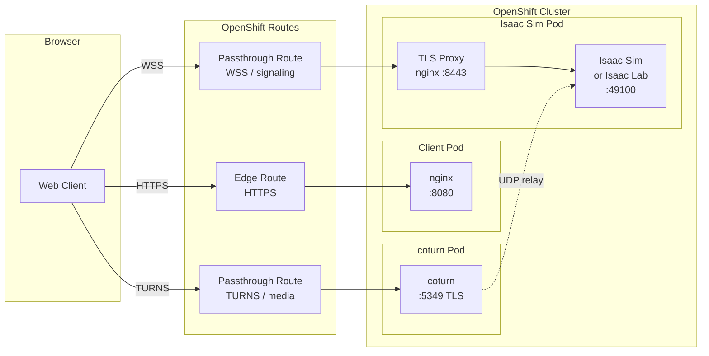

# Isaac Sim Browser Streaming on OpenShift

> [!NOTE]
> This project was developed with assistance from AI tools.

Stream NVIDIA Isaac Sim 6.0 or Isaac Lab to a web browser from an OpenShift cluster
with GPU nodes. Choose which application to deploy via the `APP` variable.

## Architecture

Isaac Sim or Isaac Lab runs headless on a GPU node with WebRTC streaming enabled.
A coturn TURN relay bridges WebRTC media (UDP) through OpenShift's HTTP-only Routes.
A lightweight web client handles the browser-side WebRTC connection.

> [!NOTE]
> Only one user will be able to access the stream at a time.



### Why TURN?

OpenShift Routes use HAProxy at L7 — they handle HTTP/WebSocket but cannot route UDP
traffic. WebRTC media transport is UDP. The coturn TURN relay accepts media over
TLS/TCP (through a passthrough Route) and relays it to the Isaac Sim pod over UDP
within the cluster network.

### Why passthrough Routes for signaling?

Kit's WebSocket signaling mixes binary WebRTC control data on the same connection,
which confuses HAProxy's HTTP parser in edge termination mode. An nginx TLS sidecar
terminates TLS at the pod and forwards raw TCP to Kit's signaling port, allowing the
passthrough Route to treat it as opaque TCP.

## Prerequisites

- OpenShift cluster with an NVIDIA L40S (or compatible) GPU node
- NVIDIA GPU Operator installed (provides device plugin, NFD labels, runtime class)
- `oc` CLI authenticated with cluster-admin
- `helm` v3
- `podman` (for building the web client image)
- An [NGC API key](https://ngc.nvidia.com/setup) for pulling container images from `nvcr.io`
- A container registry (e.g., `quay.io`) for the web client image

## TLS Certificates

The coturn TURN relay and the signaling TLS proxy require a certificate matching the
cluster's `*.apps.<domain>` wildcard. `make deploy` handles this automatically:

1. **Primary (OSD/Hive-managed clusters):** Copies the cluster's managed wildcard cert
   from `openshift-ingress` into the deployment namespace as `coturn-tls`. This is
   automatic and requires no configuration.

2. **Fallback (self-managed clusters):** If no Hive-managed cert is found, deploy will
   fail with an error. Create the secret manually before deploying:
   ```bash
   # Using cert-manager with a ClusterIssuer:
   oc apply -f - <<EOF
   apiVersion: cert-manager.io/v1
   kind: Certificate
   metadata:
     name: coturn-tls
     namespace: isaac-sim-streaming
   spec:
     secretName: coturn-tls
     dnsNames:
       - "*.apps.<your-cluster-domain>"
     issuerRef:
       name: letsencrypt
       kind: ClusterIssuer
   EOF

   # Or manually with openssl:
   oc create secret tls coturn-tls \
     --cert=tls.crt --key=tls.key \
     -n isaac-sim-streaming
   ```

## Quick Start

```bash
# 1. Configure environment
cp .env.example .env
# Edit .env with your NGC API key, cluster domain, and registry

# 2. Build and push the web client
make build-client push-client

# 3. Deploy Isaac Sim (default) -OR- Isaac Lab (one per GPU)
make deploy                   # Isaac Sim
APP=isaac-lab make deploy     # OR Isaac Lab

# 4. Wait for startup (5-10 min cold start, check with oc get pods)

# 5. Open in browser
make open
```

## Makefile Targets

| Target | Description |
|---|---|
| `deploy` | Install Helm chart to OpenShift |
| `undeploy` | Uninstall Helm chart |
| `build-client` | Build web client container image |
| `push-client` | Push web client image to registry |
| `open` | Open web client URL in browser |
| `restart` | Restart application pod |
| `template` | Render Helm templates locally (dry-run) |

## Configuration

All configuration is in `.env` (see `.env.example`). Key values:

| Variable | Description |
|---|---|
| `APP` | Application to deploy: `isaac-sim` (default) or `isaac-lab` |
| `NAMESPACE` | OpenShift namespace (default: `isaac-sim-streaming`) |
| `CLUSTER_DOMAIN` | Cluster apps domain (e.g., `apps.mycluster.example.com`) |
| `NGC_API_KEY` | NGC API key for pulling `nvcr.io` images |
| `CLIENT_IMAGE` | Full image reference for the web client |
| `COTURN_PASSWORD` | TURN relay password (auto-generated if empty) |
| `GPU_PRODUCT` | GPU product label (default: `NVIDIA-L40S`) |
| `STREAM_WIDTH` | Stream width in pixels (default: `1920`) |
| `STREAM_HEIGHT` | Stream height in pixels (default: `1080`) |
| `STREAM_FPS` | Stream framerate (default: `30`) |
| `ISAAC_LAB_SCRIPT` | Isaac Lab script filename from `scripts/` (default: `demo_lab.py`) |

## Isaac Lab

Isaac Lab is a robot-learning framework that runs on top of Isaac Sim. It uses the
same Kit SDK and WebRTC streaming extensions, so the entire streaming infrastructure
is shared. The only differences are the container image and the entrypoint.

| | Isaac Sim | Isaac Lab |
|---|---|---|
| Container | `nvcr.io/nvidia/isaac-sim:6.0.0-dev2` | `nvcr.io/nvidia/isaac-lab:3.0.0-beta1` |
| Entrypoint | `runheadless.sh` | `isaaclab.sh -p <script>` |
| UI | Full Isaac Sim application | Isaac Sim viewport |

To deploy Isaac Lab:

```bash
APP=isaac-lab make deploy
```

### Custom scripts

Isaac Lab requires a Python script defining the simulation environment. A default
cartpole demo (`scripts/demo_lab.py`) is included.

To use your own script:

1. Add your script to the `scripts/` directory
2. Deploy with the script name:
   ```bash
   APP=isaac-lab ISAAC_LAB_SCRIPT=my_env.py make deploy
   ```

To iterate on a script without rebuilding the container:

1. Edit `scripts/my_env.py`
2. `make deploy` (updates the ConfigMap with the new script content)
3. `make restart` (restarts the pod, picks up the new script)
